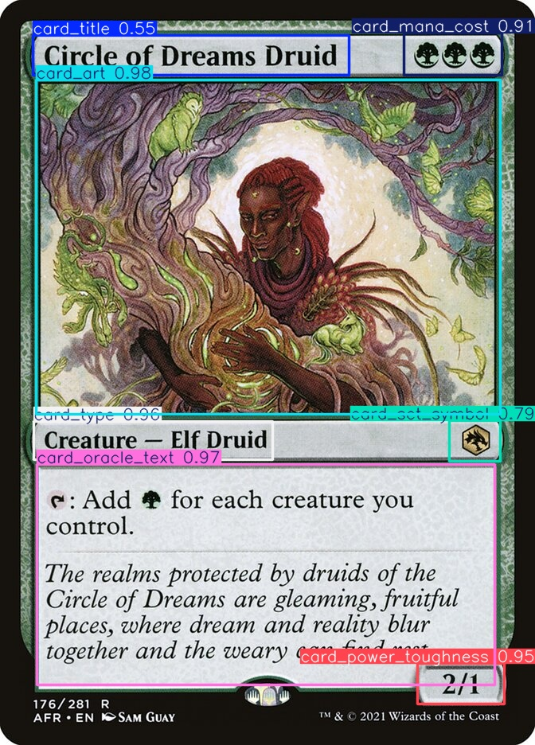
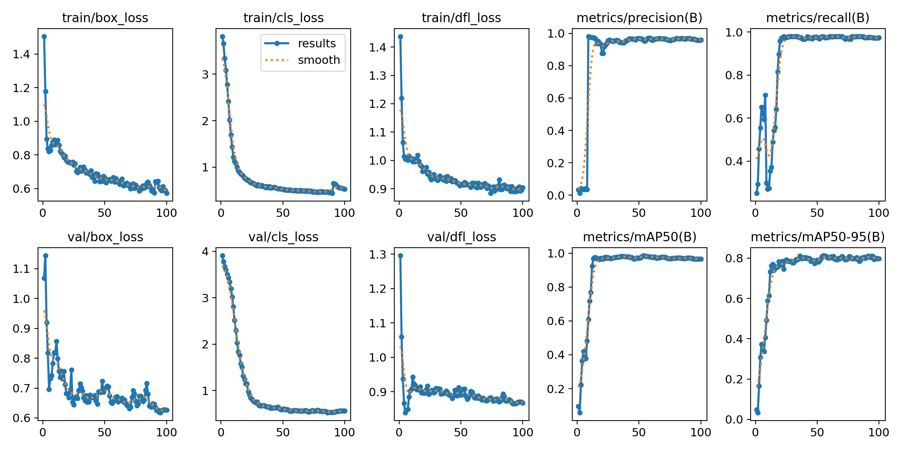

# YOLO11 MTG Card Segmentation



**Overview:**  
This project provides a simple end-to-end pipeline for training a custom YOLO11 model that segments high-resolution Magic: The Gathering card scans into key visual components. The model is trained to detect 7 card elements—**card_title**, **card_art**, **card_type**, **card_set_symbol**, **card_mana_cost**, **card_oracle_text**, and **card_power_toughness**—so that it can accurately locate these segments in new, unseen card images.

---

## Workflow

1. **Data Download & Extraction**  
   - **Script:** `unzip-dataset.py`  
   Downloads the raw ZIP files (images, training annotations, and validation annotations) if they don’t already exist, then extracts the contents from their subfolders into designated directories.

2. **Annotation Conversion & Data Splitting**  
   - **Script:** `convert-dataset.py`  
   Converts XML annotation files into YOLO-format labels. The script processes training annotations (from `data/annotations`) and validation annotations (from `data/control_annotations`) separately, copying the corresponding images into `data/images/train` and `data/images/val` while saving the labels in `data/labels/train` and `data/labels/val`.

3. **Dataset Configuration**  
   - **Script:** `setup-yolo11-yaml.py`  
   Generates the YAML configuration file (`my_custom_dataset.yaml`) for YOLO11. This file specifies the relative paths to the training (`images/train`) and validation (`images/val`) image directories, the number of classes (`nc: 7`), and the class names.

4. **Model Training**  
   - **Script:** `train-yolo.py`  
   Loads a pretrained YOLO11 model and fine-tunes it on your custom dataset as defined in the YAML file. Training parameters such as epochs and image size are configured within the script.

5. **Inference**  
   - **Script:** `detect_image.py`  
   Loads the trained model and performs inference on a new, unannotated card image. The script displays the image with bounding boxes around detected card elements and saves the output image for review.

---

## Environment Setup

1. **Create a Virtual Environment** (Python 3.9+ recommended):

   ```bash
   python -m venv venv
   # Activate on Windows:
   venv\Scripts\activate
   # or on Linux/MacOS:
   source venv/bin/activate
   ```

2. **Install Required Packages:**

   ```bash
   pip install -r requirements.txt
   ```


---

## How to Use

1. **Download & Extract Dataset:**
   ```bash
   python unzip-dataset.py
   ```

2. **Convert Annotations & Split Data:**
   ```bash
   python convert-dataset.py
   ```

3. **Generate YAML Configuration:**
   ```bash
   python setup-yolo11-yaml.py
   ```

4. **Train the Model:**
   ```bash
   python train-yolo.py
   ```

5. **Run Inference on a New Image:**
   ```bash
   python detect_image.py path/to/your/image.jpg
   ```

---

## Resources

- **Dataset:**  
  [MTG Face Objects Classification Dataset](https://huggingface.co/datasets/JakeTurner616/mtg_face_objects_classifcation)

- **Pre-trained Model:**  
  [MTG Card Segmentation YOLO11 Model](https://huggingface.co/JakeTurner616/mtg-card-segmentation-yolo11)

---

## Results

- **Training Metrics:**  

